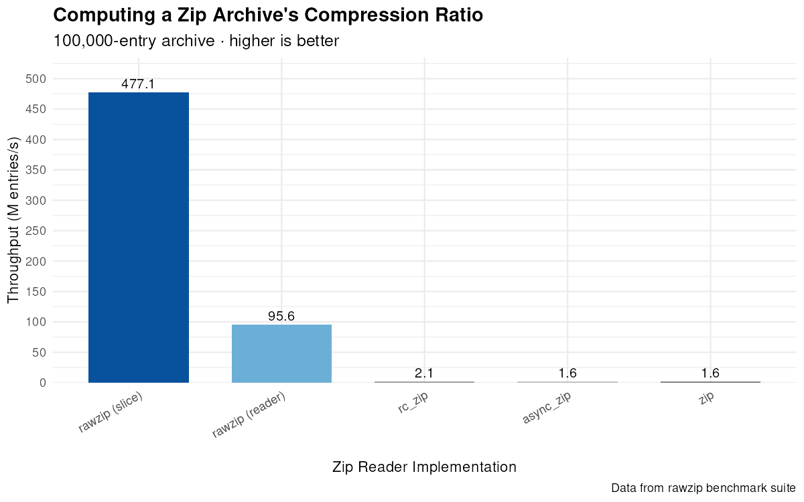
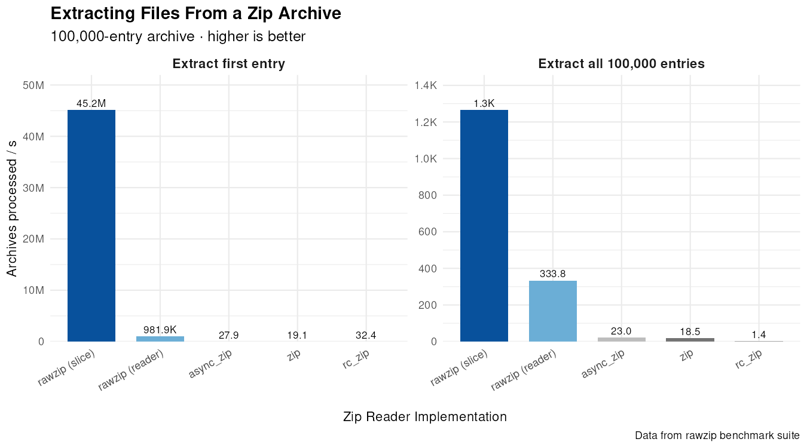
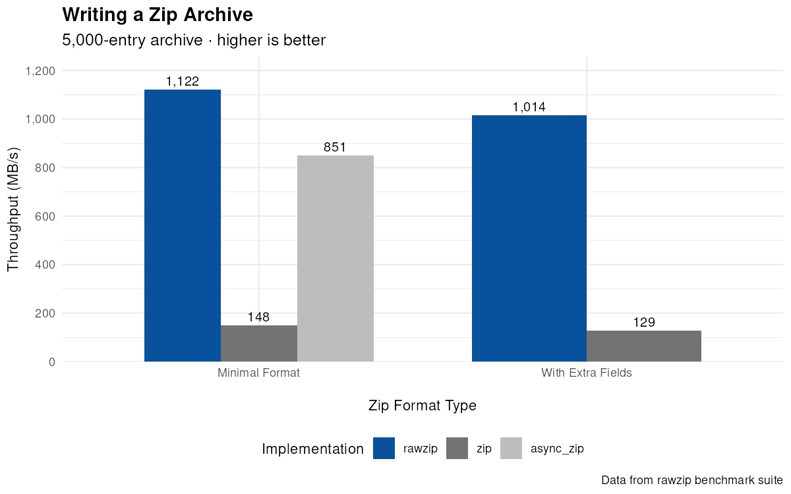

# Rawzip

<!-- cargo-rdme start -->

A low-level, composable Zip archive reader and writer.

## Features

- Pure Rust. Zero dependencies. Zero unsafe. [Untouchable performance](https://github.com/nickbabcock/rawzip#benchmarks).
- Zip64 support (read and write archives with 100k+ entries, >100 GB archives, >5 GB entries)
- Fan out streaming (de)compression across multiple threads
- Zero-allocation streaming reader. In-memory reads are zero-copy and `no_std`
- Bring the compression and strong encryption that fits your workload
- Use the built-in CRC, entry integrity checks, and ZipCrypto, or swap in your own

rawzip was born from the need for performance and choice. Other zip libraries materialize the central directory with an avalanche of allocations and tie one to a particular decompression implementation. rawzip does neither. There are half a dozen high-quality DEFLATE crates and several Zstandard crates. All have their uses, so users should be empowered to choose what makes sense. The Zip file specification does not change frequently, and the goal is that this library won't change frequently either.

## Quickstart

A round-trip: write a DEFLATE-compressed `file.txt`, then read it back. rawzip
handles the archive structure, while you provide compression (here [`flate2`]), unlike other batteries-included libraries such as [zip](https://crates.io/crates/zip), [rc-zip](https://crates.io/crates/rc-zip), or [async_zip](https://crates.io/crates/async-zip).

The main entrypoints:

- [`ZipArchive::from_file`](https://docs.rs/rawzip/latest/rawzip/archive/struct.ZipArchive.html#method.from_file) - zero-allocation streaming reader
- [`ZipArchive::from_slice`](https://docs.rs/rawzip/latest/rawzip/archive/struct.ZipArchive.html#method.from_slice) - zero-copy, `no_std` reader
- [`ZipArchiveWriter::new`](https://docs.rs/rawzip/latest/rawzip/writer/struct.ZipArchiveWriter.html#method.new)

```rust
use std::io::Read;

let data = b"Hello, world!";

// Create a new zip archive around a `Write` implementation.
let mut output = Vec::new();
let mut archive = rawzip::ZipArchiveWriter::new(&mut output);

// Declare the entry, then point your compressor at it. `config.wrap` tracks the
// uncompressed size and CRC that the Zip data descriptor needs.
let (mut entry, config) = archive.new_file("file.txt")
    .compression_method(rawzip::CompressionMethod::DEFLATE)
    .start()?;
let encoder = flate2::write::DeflateEncoder::new(&mut entry, flate2::Compression::default());
let mut writer = config.wrap(encoder);
std::io::copy(&mut &data[..], &mut writer)?;

// Unwind the layers, then write the central directory.
let (encoder, descriptor) = writer.finish()?;
encoder.finish()?;
entry.finish(descriptor)?;
archive.finish()?;

// --- It's reading time! --- We're reading from a slice for brevity
let archive = rawzip::ZipArchive::from_slice(&output)?;
let mut entries = archive.entries();
let entry = entries.next_entry()?.unwrap();

// Demonstrate normalizing file paths to avoid Zip Slip vulnerabilities.
assert_eq!(entry.file_path().try_normalize()?.as_ref(), "file.txt");
assert_eq!(entry.compression_method(), rawzip::CompressionMethod::DEFLATE);

// A wayfinder locates the entry's data within the archive.
let local_entry = archive.get_entry(entry.wayfinder())?;
let decompressor = flate2::bufread::DeflateDecoder::new(local_entry.data());

// A verifying reader checks the decompressed size and CRC as you read.
let mut actual = Vec::new();
local_entry.verifying_reader(decompressor).read_to_end(&mut actual)?;
assert_eq!(&data[..], actual);
```

## Guide

There's quite a bit of depth to ZIP archives, so jump into the desired section.

1. [Reading](https://docs.rs/rawzip/latest/rawzip/guide/reading/)
2. [Performance](https://docs.rs/rawzip/latest/rawzip/guide/performance/): Dial in performance with custom CRC, dependencies, and parallel processing
3. [Validation](https://docs.rs/rawzip/latest/rawzip/guide/validation/): Create a custom entity integrity policy
4. [Encryption](https://docs.rs/rawzip/latest/rawzip/guide/encryption/): WinZip AES and ZipCrypto

[`flate2`]: https://crates.io/crates/flate2

## Security

Zip files have a checkered past, with maliciously crafted zips causing major headaches.

By virtue of rawzip being a minimal library, several mitigations become the responsibility of the consuming application.

What rawzip provides:

- Memory safety
- Structural validation of EOCD, central directory, and local file headers
- Opt-in file path normalization to protect against Zip Slip vulnerabilities
- An opt-in CRC and size verification of inflated data

What consumers must handle:

- Zip bombs by implementing maximum compression ratios, maximum file sizes, and checks for overlapping file data
- Symlink attacks with safe file system operations
- Zip quines and potentially infinite recursion by limiting the amount of nesting
- Multiple file entries with the same file name
- Unexpected central directory entry count. When the central directory iterator ends or errors, check against the number of expected entries to know whether an error should be raised or suppressed.

See the [extractor example](https://github.com/nickbabcock/rawzip/blob/master/examples/extract.rs) for a practical starting point that applies several of these mitigations.

<!-- cargo-rdme end -->

## Benchmarks







If you want to rip through zips as fast as possible, rawzip is for you. Doesn't matter if the zips are 100 GB+ with 200k entries, nothing will be faster.

Reproduce the benchmarks with the following command:

```bash
(cd compare && cargo clean && cargo bench)
find ./compare/target -wholename "*/new/raw.csv" -print0 | xargs -0 xsv cat rows > assets/rawzip-benchmark-data.csv
```

The data can be analyzed with the R script found in the assets directory. Keep in mind, benchmarks will vary by machine.
